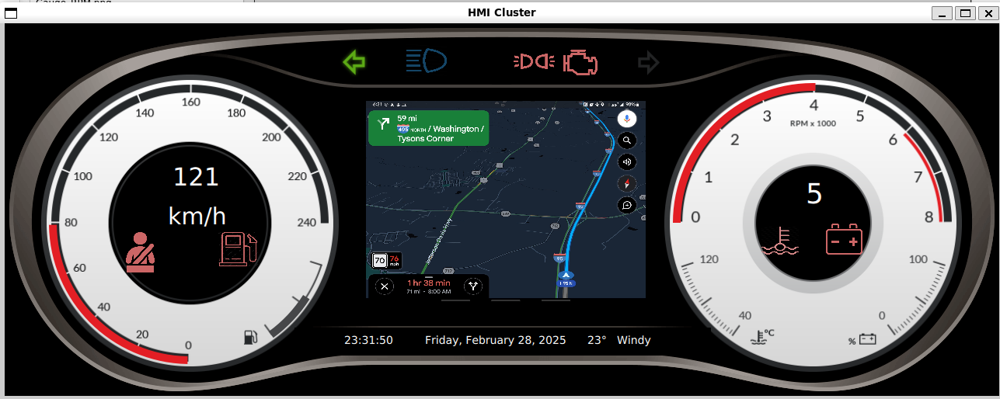

### Installing ###

1. Install dependencies
2. qmake
3. make -j8

### Dependencies ###

- Qt 5.12
- Some Extra Qt Modules

### Keyboard Bindings.
- F1 - F4 turn on/off iso icons.
- Num 1 - Num 6 turn on / off warning signals.
- Enter for changing Map , Song Menu , Car Body ( Tire Pressures. )
- Space for charge screen
- A, D inc. or deg. battery in charge screen.

